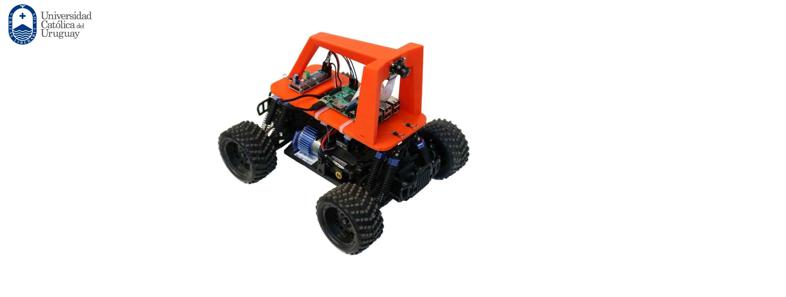

# Robocar OpenCV Driver

## Dependencies

You can install dependencies via `pip install`

* requests
* cv2
* urllib
* numpy
* matplotlib

## Driving the car

1- Create a Controller instance

    robocarController = Controller()

2- Call the get_video function 

    robocarController.get_video()

## Configurable parameters

* `IP`: Robocar IP (default is 192.168.0.110)
* `Port`: Robocar port(default is 8887)
* Color filters: (Restrict the colors to detect between the bounds)
    * `rl`: Red lower bound (range 0 - 255)
    * `gl`: Green lower bound (range 0 - 255)
    * `bl`: Blue lower bound (range 0 - 255)
    * `ru`: Red upper bound (range 0 - 255)
    * `gu`: Green upper bound (range 0 - 255)
    * `bu`: Blue upper bound (range 0 - 255)

* Configuration: (Filters to apply)
    * `apply_canny`: (1 yes, 0 no)
    * `apply_blur` : (1 yes, 0 no)
    * `apply_hough`: (1 yes, 0 no)
        
* Canny edge configuration:
    * `threshold1`
    * `threshold2`

* Blur configuration
    * `kernel`
* Hough lines configuration
    * `threshold`
    * `minLineLength`
    * `maxLineGap`